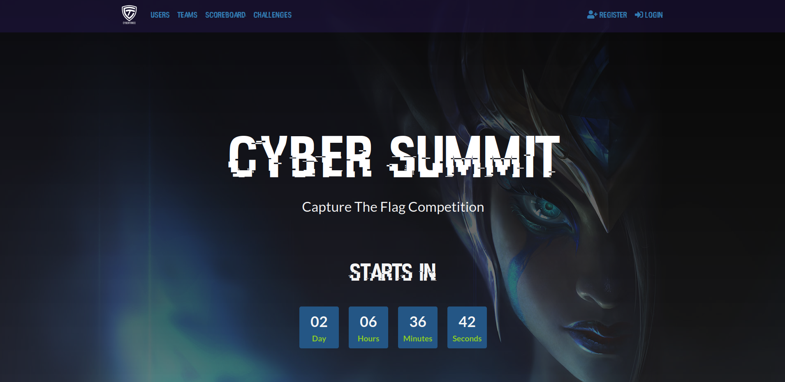

# CyberSummit CTFd Theme

This theme version v1.0 was created for CyberSummit CTF which took place on 19 march 2023 by CyberTrace.

  
   
  

1. [Installation](#installation)
2. [Acknowledgements](#acknowledgements)
3. [Credits](#credits)

# Installation

Copy the theme folder to `/path/to/CTFd/themes/<theme_name>`. Then, in Admin Panel > Configuration > Theme, select the desired theme.

# Acknowledgements

## Contributors

* Ya$$ine
* Haroun
* Mo3

# Credits

- [CTFd](https://github.com/CTFd/CTFd) (Logo by Laura Barbera, Theme by Christopher Thompson, Notification Sound by Terrence Martin), under [Apache License
Version 2.0](https://www.apache.org/licenses/LICENSE-2.0)

- [Hacked font](https://watchdogsfont.com/) by David Libeau, under [CC BY 4.0](https://creativecommons.org/licenses/by/4.0/)

